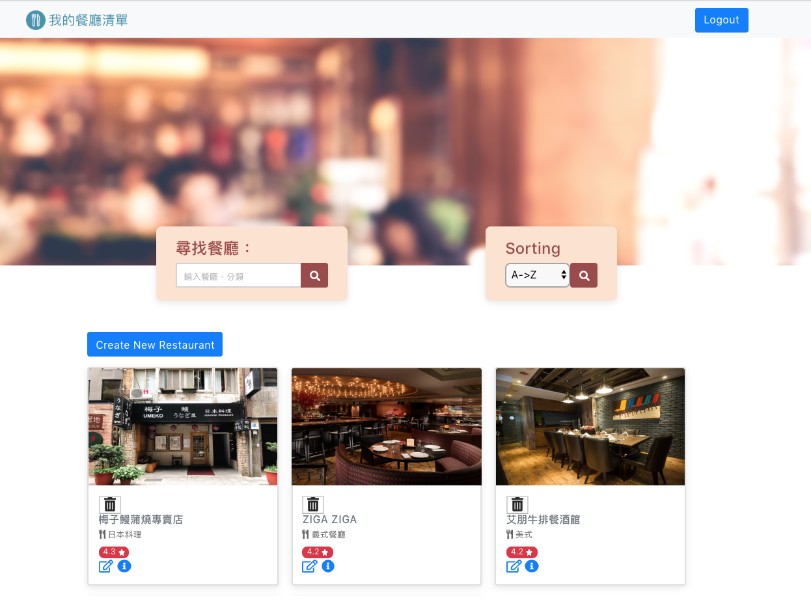

# Restaurant Web Application 1.0
This application is to let user search and view the restaurant details (Rating, descriptions etc)

# Main page


## Getting Started
1. open terminal - git clone from branch --> user-login-register/flash-message
```
git clone https://github.com/crazy-hour-ai/restaurant_list.git from branch user-login-register/flash-message
```
2. Initialize project
```
npm install
```
3. Start project on development mode
```
npm run dev
```
4. Start the project on browser by 
```
http://localhost:3000 
```

## Settings
Create .env file under root directory for using Facebook API,
```
FACEBOOK_ID=xxxxxxxx
FACEBOOK_SECRET=xxxxxxxx
FACEBOOK_CALLBACK=http://localhost:3000/auth/facebook/callback
```

## Feature
+ On the homepage, user can search restaurant name by keywords
+ User can view all the list of restaurants and summary
  - Restaurant Image
  - Restaurant Name
  - Restaurant Category
  - Restaurant Raging
+ User can click the restaurant for more details description
  - Category
  - Address
  - Phone
  - Description
  - Image
